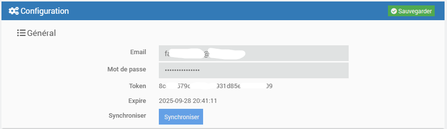
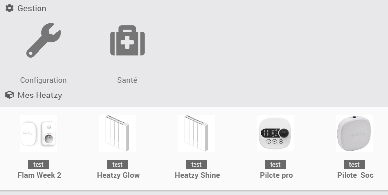
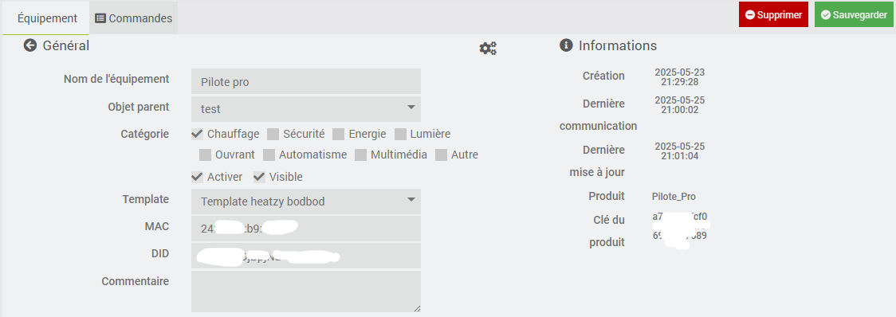
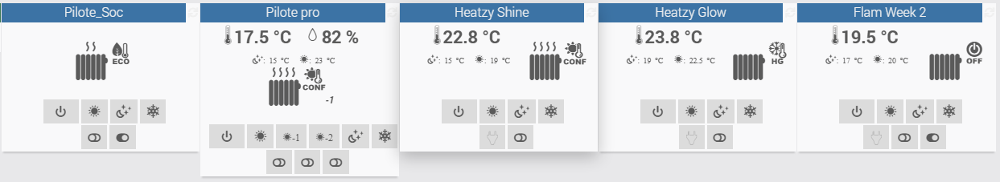

Heatzy
====

Description
=== 
Ce plugin permet de gérer vos modules pilote et flam de la marque Heatzy.

Les modules gérés sont :

* **Heatzy**
* **Flam/Plugzy**
* **Pilote seconde génération**
* **Pilote SoC**
* **Pilote SoC3**
* **Pilote_Pro**
* **Elec Pro (Acova version)**
* **Radiateur Glow**
* **Radiateur Shine**
* **Radiateur Onyx**
* **Radiateur Bloom**
* **Radiateur Flat**
* **Radiateur INEA**

Pré-requis
=== 
L'utilisation de ce plugin requiert de créer un compte avec l'application Heatzy disponible sur Android et iOS.

Il est nécessaire de suivre le guide d'installation et d'utilisation fourni pour mettre en service les modules Heatzy.

Configuration
==

Configuration du plugin
-------------
Après téléchargement du plugin, il vous suffit juste d'activer celui-ci et de saisir l'adresse mail et le mot de passe pour accéder au cloud Heatzy.

Puis cliquez sur synchroniser pour récupérer la liste des modules Heatzy pilotes associés à votre compte.

* **Email** : votre adresse email utilisé lors de votre enregistrement dans le cloud
* **Mot de passe** : votre mot de passe d'accès renseigné lors de votre enregistrement dans le cloud
* **Token** : votre token d'accès au cloud, après la synchronisation de vos modules
* **Expire** : la date d'expiration du token d'accès au cloud, après la synchronisation de vos modules
* **Synchroniser** : permet de synchroniser vos modules Heatzy avec le cloud

Configuration des objets connectés Heatzy
-------------
La configuration des modules Heatzy est accessible à partir du menu 'Plugins' > 'Objets connectés'.

Une fois que vous cliquez sur un équipement vous retrouvez la configuration de l'équipement :

Vous retrouvez dans la section **Général**

* **Nom de l'équipement** : nom de votre module Heatzy, permet de renommer le module dans le cloud.
* **Objet parent** : objet parent auquel appartient votre équipement
* **Catégorie** : catégorie de l'équipement, par défaut chauffage
* **Activer** : permet de rendre votre équipement actif
* **Visible** : le rend visible sur le dashboard
* **Template** : Choix du template d'affichage
  * template **bodbod** : Nouveau template unique et commun à tous les modules *(les commandes non prises en charge par le module ne sont pas affichées)*
  * template **l3flo** : Template d'origine créé par l3flo (/!\ Ces templates n'est plus maintenu et disparaitra des une future version)
  * template **jeedom** : Laisse jeedom créer les commandes et informations par défaut
* **MAC** : l'adresse MAC du module Heatzy
* **DID** : l'identifiant du module Heatzy

Vous retrouvez dans la section **Informations**

* **Création** : date et heure de création de l'équipement
* **Dernière communication** : date et heure de la dernière communication du module Heatzy dans le cloud
* **Dernière mise à jour** : date et heure de mise à jour de l'équipement
* **Type** : pilote ou flam
* **Produit** : le type de produit de la marque heatzy

Configuration des commandes des objets connectés Heatzy
-------------

### Wigdet dashboard desktop

### Wigdet dashboard mobile

Chaque équipement dispose des commandes actions :

* **Off** : permet de passer en mode off
* **Confort** : permet de passer en mode confort
* **Eco** : permet de passer en mode eco
* **HorsGel** : permet de passer en mode hors-gel
* **refresh** : permet forcer le rafraichissement de l'etat de l'équipement
* **Activer Programmation** : permet d'activer la programmation, pré-définie par l'application Heatzy
* **Désactiver Programmation** : permet d'activer la programmation, pré-définie par l'application Heatzy
* **Activer le verrouillage** : permet d'activer le verrouillage et d'éteindre la led, pré-définie par l'application Heatzy
* **Désactiver le verrouillage** : permet d'activer le verrouillage et d'allumer la led, pré-définie par l'application Heatzy
* **Activer la détéction de fenetre ouverte** : permet d'activer la détéction de fenetre ouverte (le radiateur passe en mode HorsGel si la température chute de 2° en moins de 5min)
* **Désactiver  la détéction de fenetre ouverte** : permet d'activer la détéction de fenetre ouverte
* **Plugzy OFF** : Permet d'éteindre le plugzy *(seulement pour l'équipement de type flam)*
* **Plugzy ON** : Permet d'allumer le plugzy *(seulement pour l'équipement de type flam)*

D'une commande **Etat Consigne** de type _numerique_ :

* **0** : Mode Confort
* **4** : Mode Confort-1 (uniquement pour les modules 6 ordres)
* **5** : Mode Confort-2 (uniquement pour les modules 6 ordres)
* **1** : Mode Eco
* **2** : Mode Hors-gel
* **3** : Mode Off

Et d'une commande **Mode** de type _string_ :

* **Confort**
* **Confort-1** (uniquement pour les modules 6 ordres)
* **Confort-2** (uniquement pour les modules 6 ordres)
* **Eco**
* **HorsGel**
* **Off**

Et d'une commande **Etat programmation** de type _binaire_ :

* **1** : La programmation est activée
* **0** : La programmation est désactivée

Et d'une commande **Etat Verrouillage** de type _binaire_ :

* **1** : Le verrouillage est activé
* **0** : Le verrouillage est désactivé

Et d'une commande **Détéction fenetre ouverte** de type _binaire_ :

* **1** : La détéction est activée
* **0** : La détéction est désactivée
                                  
Et de commandes de type _numerique_ :

* **Temp. confort** : la température de consigne du mode confort
* **Temp. eco**   : la température de consigne du mode eco
* **Temperature** : la température relevé par le module
* **Taux Humidité** : le taux d'humidité relevé par le module

>Vous pouvez tester la valeur de la commande info *Etat* ou *Mode* dans vos scénarios.

**Tableau des commandes possible par modules :**

*(les futurs modules qui ne sont pas dans ce tableau seront naturellement pris en charg si l'utilisation de l'APi est la même)*
 | Commande | Type | Pilote_Soc | Pilote_Soc3 | Pilote_Pro | Elec_Pro | Glow | Shine | Flam_Week2 | INEA | Cool | Relais | 
 | ----- | ----- | ----- | ----- | ----- | ----- | ----- | ----- | ----- | ----- | ----- | ----- | 
 | Etat Consigne 4 ordres : 0/1/2/3 6 ordres : 0/1/2/3/4/5 | info | Oui | Oui | Oui | Oui | Oui | Oui | Oui | Oui | N/A | N/A | 
 | Mode 4 ordres : Confort/Eco/Hors Gel/Off 6 ordres : Confort/Confort-1/Confort-2/Eco/Hors Gel/Off | info | Oui | Oui | Oui | Oui | Oui | Oui | Oui | Oui | N/A | N/A | 
 | Confort | action | Oui | Oui | Oui | Oui | Oui | Oui | Oui | Oui | N/A | N/A | 
 | Confort-1 | action | N/A | N/A | Oui | N/A | N/A | N/A | N/A | N/A | N/A | N/A | 
 | Confort-2 | action | N/A | N/A | Oui | N/A | N/A | N/A | N/A | N/A | N/A | N/A | 
 | Eco | action | Oui | Oui | Oui | Oui | Oui | Oui | Oui | Oui | N/A | N/A | 
 | Hors Gel | action | Oui | Oui | Oui | Oui | Oui | Oui | Oui | Oui | N/A | N/A | 
 | Off | action | Oui | Oui | Oui | Oui | Oui | Oui | Oui | Oui | N/A | N/A | 
 | Température courante | info | N/A | N/A | Oui | N/A | Oui | Oui | Oui | N/A | N/A | N/A | 
 | Température Confort | info | N/A | N/A | Oui | N/A | Oui | Oui | Oui | N/A | N/A | N/A | 
 | Température Eco | info | N/A | N/A | Oui | N/A | Oui | Oui | Oui | N/A | N/A | N/A | 
 | Humidité courante | info | N/A | N/A | Oui | N/A | N/A | N/A | N/A | N/A | N/A | N/A | 
 | Etat Programmation | info | Oui | Oui | Oui | Oui | Oui | Oui | Oui | Oui | N/A | N/A | 
 | Programmation On | action | Oui | Oui | Oui | Oui | Oui | Oui | Oui | Oui | N/A | N/A | 
 | Programmation Off | action | Oui | Oui | Oui | Oui | Oui | Oui | Oui | Oui | N/A | N/A | 
 | Etat Vérouillage | info | Oui | Oui | Oui | Oui | N/A | N/A | Oui | Oui | N/A | N/A | 
 | Vérouillage On | action | Oui | Oui | Oui | Oui | N/A | N/A | Oui | Oui | N/A | N/A | 
 | Vérouillage Off | action | Oui | Oui | Oui | Oui | N/A | N/A | Oui | Oui | N/A | N/A | 
 | Etat Fenetre Ouverte | info | N/A | N/A | Oui | N/A | N/A | N/A | ? | ? | N/A | N/A | 
 | Fenetre Ouverte On | action | N/A | N/A | Oui | N/A | N/A | N/A | ? | ? | N/A | N/A | 
 | Fenetre Ouverte Off | action | N/A | N/A | Oui | N/A | N/A | N/A | ? | ? | N/A | N/A | 
 | Etat On_Off (plugzy ou OnOff) | info | N/A | N/A | N/A | N/A | Oui | Oui | Oui | N/A | N/A | N/A | 
 | On | action | N/A | N/A | N/A | N/A | Oui | Oui | Oui | N/A | N/A | N/A | 
 | Off | action | N/A | N/A | N/A | N/A | Oui | Oui | Oui | N/A | N/A | N/A | 

FAQ
=== 

**Quelle est la fréquence de rafraîchissement ?**

Le système récupère l'état des modules **toutes les minutes**. L'état de la programmation est rafraîchie toutes les 30 minutes pour les modules Heatzy et Flam.

>Pour les modules Heatzy et Flam, il est possible de désactiver le rafraîchissement de l'état de la programmation en décochant la fonctionnalités **con30** depuis la page de configuration du plugin. Pour les autres modules la programmation est lu dans la commande **timer_switch**.

**Lorsque je désactive la programmation, l'état n'est pas mis à jour ?**

Le plugin met à jour les 336 tâches associées au module Heatzy ou Flam pour les désactiver/activer, soit 336 requêtes HTTP envoyé au cloud Heatzy. Il est donc nécessaire d'attendre quelques secondes que le plugin finisse d'activer/désactiver chacune des tâches. L’état de la programmation est mis à jour si tous ce passe bien.

**Quelle est la durée de vie du token utilisateur d'accès au cloud ?**

Le token d'accès au cloud change à chaque synchronisation avec une validité d'environ 6 mois. 
Un nouveau token est demandé au cloud automatiquement 24h avant que celui-ci expire.

**Peut-on commander les modules en local (sans cloud) ?**

Malheureusement, cette fonctionnalité n'existe pas sur les modules Heatzy.
Une requete a été formulée en ce sens aux équipes Heatzy

**Mon équipement n'est pas rafraîchi ?**

Vérifiez si l'équipement est bien activé.
                                               
**Je viens de mettre à jour le plugin, que dois-je faire ?**

Il est conseillé de synchroniser les modules via la page de configuration du plugin.                            
                                               
**J'ai un type de module qui n'est pas répertorié sur cette page, que faire ?**

Le plugin va créer de lui même toutes les commandes qui sont connues dans les autres modules. 
S'il manque des commandes, n'hésitez pas à faire un message sur le forum jeedom (avec le tag heatzy)

**Mon module n'est plus dans l'application Heatzy, que faire ?**

Dans un premier temps, fermer votre application mobile et revérifiez.
S'il a été supprimé de l'application, le plugin ne pourra rien faire.
Reportez vous aux manuels des produits : https://drive.google.com/drive/folders/1pbrZ7RRNZf8yzdbH-cd7Fk9ih2j7WZFd

**Leplugin renvoit des erreurs 8xxx ou 9xxx, a quoi correspondent-ils ?**

Les erreurs renvoyées par l'API gizwits sont repartoriés ici : https://docs.gizwits.com/en-us/AppDev/APICloudSDK.html#Error-codes
Ces sont des libellés tchniques et pas forcement compréhensibles par tout le monde.
N'hésitez pas à faire un message sur le forum jeedom (avec le tag heatzy)